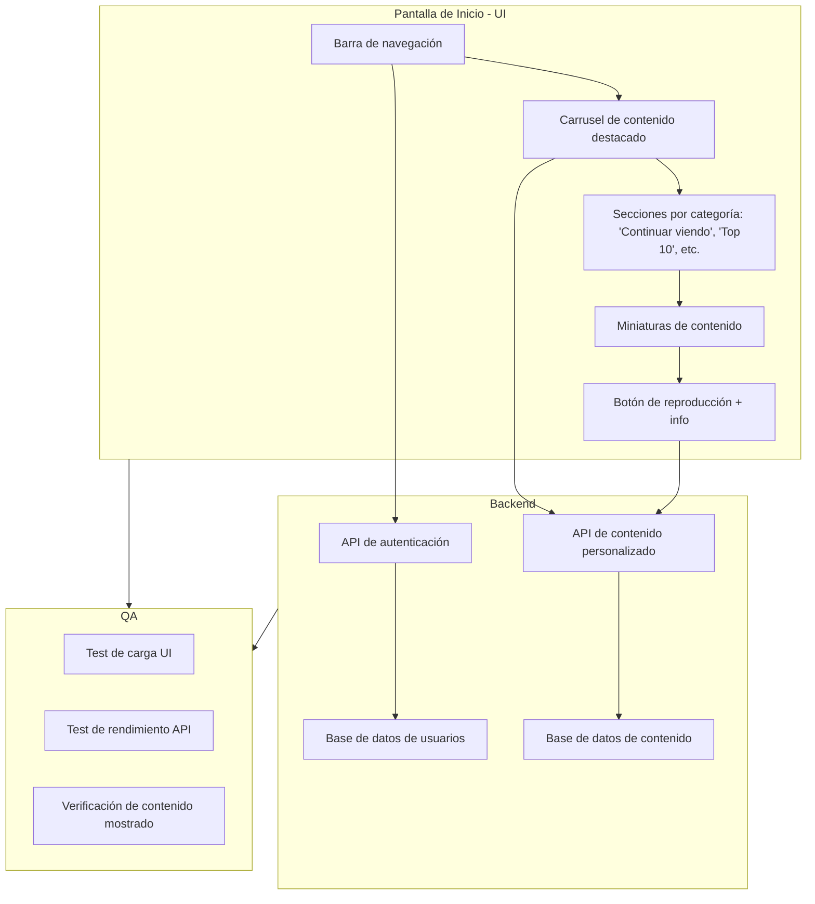

# 📌 Presentación de Roles del Proyecto

## 0) Integrantes del equipo de estudio y sus responsabilidades en el repositorio (*actualizar*)

- 1 . Flores Solis Marcelo Sebastian - Quality Manager  
- 2 . Piero Andree Zamora Aquino - FrontEnd  
- 3 . Gabriel Alberto Coaguila Quicaña - BackEnd  
- 4 . Barbara Amira Cuba Guevara - Desarrollador Android  
- 5 . Alejandro Jesús Mendoza Pantigoso - Desarrollador Android  
- 6 . Deyci Andrea Camargo Ramos - Desarrollador Android  
- 7 . Vanessa Katherine Condori Espinoza - FrontEnd  
- 8 . Aleyda Luz Quispe Hacha - FrontEnd  
- 9 . Jose Manuel Kana Huanqque - Backend 
- 10. Sergio Ivan Salazar Luque - Backend
  11. kevin Aldair Solis Florez-Quality Manager

## 🔧 Introducción: ¿Qué son Git y GitHub y por qué los usamos?

**Git** es un sistema de control de versiones que permite llevar el historial de cambios en archivos, especialmente útil para proyectos de software.  
**GitHub** es una plataforma en línea que permite trabajar con Git de forma colaborativa, facilitando el trabajo en equipo, el control de versiones y la integración entre miembros mediante commits, ramas y pull requests.

En este proyecto, usamos Git y GitHub para que **cada integrante documente su rol técnico dentro del equipo**, y aprenda a colaborar de manera organizada con control de versiones y revisiones grupales.

---

## 👥 Instrucciones Generales

Cada miembro del equipo debe completar su sección de rol respondiendo a las siguientes preguntas clave:

- 🧾 ¿Qué hace este rol en un proyecto real?
- 🎯 ¿Qué conocimientos y herramientas debe dominar?
- 🧠 ¿Por qué es importante este rol en el equipo?
- 📚 Cursos o recursos para capacitarse
- 💻 **Ejemplo basado en una aplicación observada** (como TikTok, WhatsApp, YouTube)
- 🔁 ¿Cómo se complementa con los demás roles?

---

## 🎨 Rol 1: Desarrollador Frontend
### ✅ ¿Qué hace el rol de frontend?
- Construye la parte visual e interactiva de una página web.
- Usa lenguajes como HTML, CSS y JavaScript.
- Convierte los diseños UI en código real, respetando el estilo y estructura.
- Asegura que el sitio sea responsive, adaptable a todo tipo de pantalla.
- Agrega interactividad: botones, formularios, menús, animaciones.
- Conecta con APIs para mostrar datos dinámicos.
- Trabaja con diseñadores, desarrolladores back-end y testers.
- Cuida la experiencia del usuario, accesibilidad y rendimiento.  

---

- **¿Cómo aprender el rol FrontEnd?

- **Cursos recomendados** (gratuitos o de plataformas como Google, Platzi, Udemy)
A continuación se presentan los cursos en línea recomendados para aprender el rol de Frontend.

### 01. Coursera
**Curso**: Otro curso de 7 meses ofrece una formación completa en desarrollo web, desde lo básico hasta técnicas avanzadas con React y gestión de proyectos en GitHub. Permite aprender a crear portafolios, enfrentarse a entrevistas y obtener un certificado que respalda la experiencia.  
**Link**: [https://www.coursera.org/professional-certificates/meta-front-end-developer](https://www.coursera.org/professional-certificates/meta-front-end-developer)

### 02. GreatLearning
**Curso**: Curso gratuito de Great Learning para aprender HTML. Incluye desarrollo web en 3 horas, conceptos clave como etiquetas, atributos y estructura, y finaliza con un certificado para iniciar tu carrera en frontend.  
**Link**: [https://www.greatlearning.com/academy/learn-for-free/courses/front-end-development-html](https://www.greatlearning.com/academy/learn-for-free/courses/front-end-development-html)

### 03. CareerFoundry
**Curso**: Este curso en línea de 2 meses enseña a diseñadores habilidades esenciales de desarrollo frontend, incluyendo programación, codificación y accesos a comunidad, preparado para potenciar tu carrera en desarrollo web y diseño UX/UI.  
**Link**: [https://www.coursera.org/professional-certificates/meta-front-end-developer](https://www.coursera.org/professional-certificates/meta-front-end-developer)

### 04. FreeCodeCamp
**Curso**: La certificación en Bibliotecas de Desarrollo Front-End ayuda a mejorar habilidades en HTML, CSS, JavaScript, y Dom, además de ofrecer proyectos para construir portafolios y aplicar conocimientos en aplicaciones modernas.  
**Link**: [https://www.coursera.org/professional-certificates/meta-front-end-developer](https://www.coursera.org/professional-certificates/meta-front-end-developer)

- 📺 Ejemplo basado en una aplicación observada: Diseño visual de la pantalla de inicio en Netflix
Este ejemplo utiliza Mermaid.js para representar visualmente el flujo y diseño básico de la pantalla de inicio de Netflix, destacando su interacción con el backend y el proceso de validación por parte del equipo de QA.

🎨 Diseño visual (simplificado)

- 🔄 Complementación con Backend y QA

Frontend (UI):
Se encarga de mostrar la estructura visual de la pantalla de inicio.
Los elementos como el carrusel y las miniaturas se alimentan con datos dinámicos del backend.

Backend:
Gestiona autenticación del usuario, personalización de contenido según historial, y obtención de metadatos desde la base de datos.
Expone APIs que son consumidas por la interfaz para mostrar contenido relevante.

QA (Quality Assurance):
Realiza pruebas automáticas y manuales para garantizar que los datos se muestran correctamente.
Evalúa el rendimiento tanto del frontend como de las APIs, y verifica que la experiencia del usuario sea estable.

---

## 🖥️ Rol 2: Desarrollador Backend
  
### ✅ ¿Qué hace el rol de backend?

Diseña y mantiene la lógica del servidor.

Administra bases de datos y procesa la información que envía y recibe la aplicación.

Crea APIs para que el frontend y otras aplicaciones puedan comunicarse con el servidor.

Se encarga de la seguridad, autenticación y autorización de los usuarios.

Garantiza que la aplicación sea rápida, estable y pueda escalar a muchos usuarios.

---

### ✅ Tecnologías y herramientas comunes:

Lenguajes: Node.js, Java, PHP, Python, Ruby, C#.

Bases de datos: MySQL, PostgreSQL, MongoDB, Redis.

Frameworks: Express.js, Spring Boot, Laravel, Django, .NET.

Otros: REST, GraphQL, Docker, Kubernetes, Nginx.

---

### ✅ Importancia del rol en el funcionamiento de la aplicación:

Es el corazón de la aplicación: gestiona los datos, las operaciones y la lógica de negocio.

Sin backend, la aplicación no podría almacenar información, autenticar usuarios ni responder a las acciones del frontend.

Asegura la seguridad de los datos y la eficiencia del sistema.

---

### ✅ Cursos recomendados:

-[Fundación Telefónica + Oracle/Desarrollo Backend con Java] 

Este curso es una formación profesional gratuita para aprender desarrollo backend con Java, desde lo básico hasta la creación de APIs REST usando Spring Boot, con certificación oficial de Fundación Telefónica.

-Ofrece certificado oficial gratuito al completar y aprobar el curso.

-Cuenta con evaluaciones automáticas y retroalimentación para seguir tu progreso.

-Tiene una comunidad activa y soporte para resolver dudas durante el aprendizaje.

-Es 100% online, sin costo, y puedes estudiar a tu propio ritmo desde cualquier lugar.ootcamp.com

Link:

(https://conectaempleo-formacion.fundaciontelefonica.com)

-[Coursera]

Cuando completes este Certificado profesional, podrías hacer que tu aprendizaje sea reconocido para crédito si eres admitido e inscrito en un programa de grado en línea.

-Te da una certificado profecional avalado por META

-Introducción al desarrollo de back-end

-Programación en Python

-Introduccion a las bases de datos

-Marco weeb con Django

-APIs

Link: 

(https://www.coursera.org/professional-certificates/meta-back-end-developer)

-[CODECADEMY]

Codecademy es una plataforma ideal para aprender backend de forma práctica e interactiva.

-Ofrece rutas profesionales con teoría, ejercicios y proyectos reales.

-El contenido está actualizado y cubre tecnologías modernas como Node.js y Python.

-Incluye retroalimentación automática y una comunidad activa para resolver dudas.

-Es una opción completa que combina práctica, claridad y recursos útiles.

Link:

(https://www.codecademy.com/learn/introduction-to-back-end-programming)

---

### ✅ Ejemplo basado en una aplicación observada:
👉 En Spotify, el backend maneja las cuentas de usuario, listas de reproducción, historial de canciones, recomendaciones y toda la lógica de la plataforma para que la app funcione de forma personalizada.

---

### ✅ Complementación:

El backend se conecta con el frontend para enviar y recibir datos (por ejemplo, cuando presionas “play” en Spotify).

También es verificado por QA para asegurar que todas las funciones trabajen bien y no haya errores.

---

## 🤖 Rol 3: Desarrollador Android

- **Ejemplo basado en una aplicación observada**: pantalla de chat en WhatsApp
- **Complementación**: requiere servicios backend y revisiones de QA

---

### ✅ ¿Qué hace un desarrollador Android?

La programación Android se refiere al proceso de desarrollo de aplicaciones móviles que funcionan con el sistema operativo Android.
Implica escribir códigos, diseñar interfaces de usuario e integrar diversas funciones para crear aplicaciones útiles para los usuarios de este sistema operativo.

---

### 🛠️ Lenguajes y herramientas comunes:

- Java: Primer lenguaje de programación compatible con Android. Gracias a su estabilidad y a su completo ecosistema de bibliotecas, sigue siendo una opción popular para muchos desarrolladores de Android.
- Kotlin: Se ha convertido rápidamente en una alternativa principal gracias a su sintaxis concisa, segura y moderna, siendo el lenguaje recomendado por Google.
- C++: Utilizado a través del Android NDK, se emplea para escribir aplicaciones de alto rendimiento, como juegos o software gráfico complejo.
- XML (eXtensible Markup Language): Lenguaje de marcado que se utiliza en Android para definir la interfaz gráfica de usuario (UI) de una app.
- Android Studio: Entorno de desarrollo oficial (IDE). 
- ADB (Android Debug Bridge): Herramienta para depurar y conectar dispositivos.

---

### 📌 Importancia del rol

El desarrollador Android es clave para crear aplicaciones móviles funcionales, seguras y eficientes. 
Su trabajo permite llegar a millones de usuarios, optimiza el rendimiento, garantiza una buena experiencia de usuario e integra funciones como GPS, notificaciones o pagos. 
Además, mantiene la app actualizada y compatible con nuevas versiones del sistema.

---

### 📚 Cursos recomendados

- [Aspectos básicos de Android con Compose – Google](https://developer.android.com/courses?hl=es-419)  
- [Developing Android Apps with Kotlin – Udacity](https://www.udacity.com/course/developing-android-apps-with-kotlin--ud9012)  
- [Android Application Development – Great Learning](https://www.mygreatlearning.com/academy/learn-for-free/courses/android-application-development)  
- [Programación Android desde cero – Cursa.app](https://cursa.app/es/curso-gratis/programacion-android-desde-cero-cdih)

---
### 🧠El rol de la programación en el desarrollo de Android 
- Automatización de Tareas
- Interacción con el Usuario (UI/UX)
- Conexión a Internet y Consumo de APIs
- Gestión de Datos Internos
- Seguridad de Datos
- Conexión con Dispositivos Externos
- Integración de Funciones Multimedia
- Geolocalización y Navegación 
- Aplicaciones en Tiempo Real
- Juegos Android 
- Realidad Aumentada (AR) y Realidad Virtual (VR)
- Aplicaciones Empresariales

## 🧪 Rol 4: Especialista en QA (Quality Assurance)

Aquí escribe tu nombre y responde a las siguientes preguntas:

---

### ✅ ¿Qué hace un QA?

El rol de QA se encarga de asegurar que el software funcione correctamente antes, durante y después del desarrollo.  
Realiza pruebas para detectar errores (bugs), verificar que las funcionalidades cumplan con los requisitos, y garantizar una experiencia de usuario fluida y libre de fallos.  
También participa en la planificación de pruebas automatizadas o manuales y en la documentación de errores.

---

### 🛠️ Técnicas y herramientas comunes:

- Pruebas manuales  
- Pruebas automatizadas (Selenium, Appium)  
- Frameworks de testing (JUnit, TestNG, Cypress)  
- Herramientas de gestión de incidencias (JIRA, Trello)  
- Reportes de pruebas y documentación de fallos

---

### 📌 Importancia del rol

El QA garantiza la calidad del producto final.  
Su trabajo es fundamental para evitar que errores lleguen al usuario final, lo cual protege la reputación del equipo y la funcionalidad de la aplicación.  
Además, actúa como puente entre desarrollo y usuarios, asegurando que las funciones trabajen como se espera.

---

### 📚 Cursos recomendados

- [Curso de Tester – Edutin](https://edutin.com/curso-de-tester)  
- [GitHub Issues – Documentación oficial](https://docs.github.com/en/issues/tracking-your-work-with-issues/configuring-issues/planning-and-tracking-work-for-your-team-or-project)  
- [Interpretación del sistema de gestión de calidad – CAD Perú](https://cadperu.com/curso/interpretacion-del-sistema-de-gestion-de-la-calidad-iso-90012015-empieza-ya)  
- [Curso de Gestión de Calidad – Edutin](https://edutin.com/curso-de-gestion-de-calidad)

---

### 📱 Ejemplo basado en una aplicación observada

En **YouTube**, un QA podría encargarse de verificar que:

- La función de "autoplay" (reproducción automática) funcione correctamente  
- Los subtítulos se sincronicen bien con el audio  
- Los botones como "Me gusta" o "Suscribirse" funcionen sin errores  
- Al cambiar la calidad del video no se interrumpa la reproducción

---

### 🤝 ¿Cómo se complementa con los demás roles?

- Trabaja con el **Frontend** para verificar que la interfaz se vea y funcione como se espera  
- Se comunica con el **Backend** para reportar errores en APIs, flujos de datos, o lógicas del sistema  
- Colabora con el desarrollador **Android** para probar funciones específicas del sistema operativo móvil  
- Ayuda al equipo a mantener altos estándares de calidad en cada fase del desarrollo

---

**Complementación:** prueba lo que hacen frontend, backend y Android.

---

## 🧩 comclucion 

Este documento forma parte de un ejercicio práctico para aplicar Git y GitHub en una actividad colaborativa, y al mismo tiempo aprender sobre los principales roles técnicos en el desarrollo web y móvil.

---

